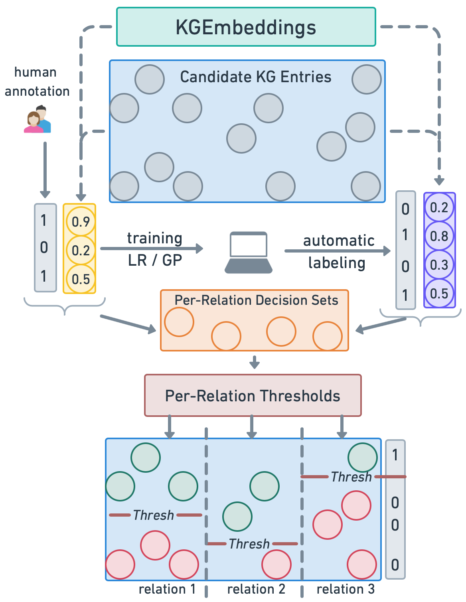

# ACTC
### ACTC: ACtive Threshold Calibration

[](https://pypi.org/pypi/cleanlab/)

This repository contains code used in our paper: </br>
**"ACTC: Active Threshold Calibration for Cold-Start Knowledge Graph Completion"**
to be presented at ACL 2023 🚀 </br>
by Anastasiia Sedova and Benjamin Roth.

For any questions please [get in touch](mailto:anastasiia.sedova@univie.ac.at).

---

### What is ACTC? 💻

ACTC is a new method for estimation the relation threshold for a cold-start knowledge graph completion.
ACTC leverages a limited set of labeled and a large set of unlabeled data in order to calculate per-relation thresholds.
Basing on these thresholds and plausibility scores calculated by a knowledge graph embedding model, one 
can make a decision about whether a new triple should be included to the knowledge graph or not.
Mostly important, it helps to find thresholds in a setting where there is only a limited set of available manual 
annotations.

<p align="center">
  
</p>

---

### Usage 🚀

The ACTC could be launched by running the `main.py` script. 

Here is an example:

```
python main.py 
--path_to_data path/to/directory/with/data/and/KGE/model/predictions/
--output_dir path/to/output/directory 
--path_to_config path/to/config/file
```
An example of a directory where data and KGE model predictions are stored (for CoDEx-s dataset + ComplEx embeddings): `data`

An example of a config file: `scripts/configs/config.json`

---
### Citation 🗒️

When using our work please cite our ArXiV preprint: 

```
@article{sedova2023actc,
      title={ACTC: Active Threshold Calibration for Cold-Start Knowledge Graph Completion}, 
      author={Anastasiia Sedova and Benjamin Roth},
      year={2023},
      eprint={2305.06395},
      archivePrefix={arXiv},
      primaryClass={cs.LG}
}
```
---
### Acknowledgements 💎

This research has been funded by the Vienna Science and Technology Fund (WWTF)[10.47379/VRG19008] and by the Deutsche Forschungsgemeinschaft (DFG, German Research Foundation) RO 5127/2-1.
